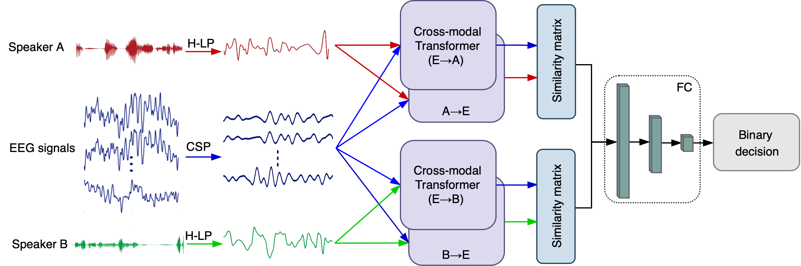

# Auditory Attention Detection via Cross-Modal Attention

This repository contains the python scripts developed as a part of the work presented in the paper "Auditory Attention Detection via Cross-Modal Attention"

## Getting Started

These files are extracted from the project stream, wchich contain the complete model and some training parameters.  In order to run the project, users need to write training and testing code, and use private or public datasets.

The public [DTU dataset](https://doi.org/10.5281/zenodo.1199011) is used in the paper. The dataset itself comes with matlab processing program, please adjust it according to your own needs.

## Paper

Paper Link:

A schematic diagram of our proposed cross-modal attention-based AAD network (CMAA). First, we employ CSP algorithm for EEG enhancement and H-LP to improve the speech envelope extraction process. Then, the cross-modal attention, which takes EEG and audio features as input, is the core component of the CMAA for dynamic interaction. The proposed CMAA architecture tackles all pairs of modalities with the cross-modal attention module, including EEG signals → audio of speaker A (E → A), EEG signals → audio of speaker B (E → B), audio of speaker A → EEG signals (A → E) and audio of speaker B → EEG signals (B→ E). Finally, the cross-modal similarity are computed and compared to determine the attended speaker. Here, the audio streams of speaker A and speaker B are denoted in red and green, while the EEG signals are denoted in blue.

## License

This project is licensed under the MIT License - see the [LICENSE.md](LICENSE.md) file for details

## Contact

Siqi Cai, Peiwen Li, Enze Su

Shien-Ming Wu School of Intelligent Engineering, South China University of Technology, Guangzhou, Guangdong Province, China.

<lintean@qq.com>

## Acknowledgments

* Some portion of the code were adapted from [yaohungt](https://github.com/yaohungt/Multimodal-Transformer) repo.

## References

